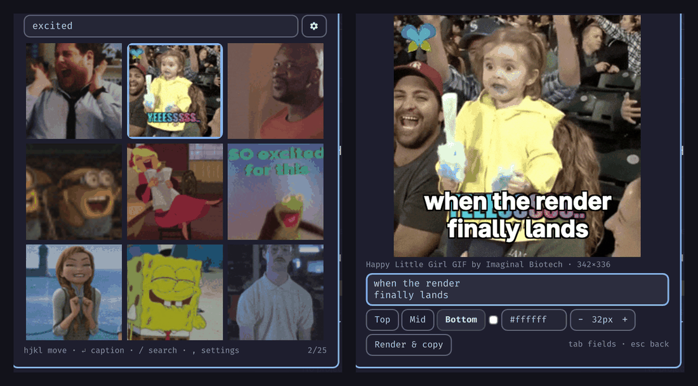

# GIF Captioner — an Omarchy plugin

Search Giphy, caption a GIF, and get the captioned **GIF and MP4 on your
clipboard**, from a bar widget. Keyboard-first: type, `Enter`, `hjkl`, `Enter`,
type the caption, `Ctrl+Enter`.



> Omarchy 4 (Arch, Hyprland, omarchy-shell). This is the Omarchy-native version
> of [gif-captioner](https://github.com/alanfortlink/gif-captioner), which also
> exists as a terminal app and a Flutter app.

## Install

```bash
omarchy plugin add https://github.com/alanfortlink/git-captioner-omarchy.git --enable
```

A GIF icon appears in the bar. Click it (or bind a key, see below) and it asks
for a Giphy API key the first time — see below.

## Requirements

| Package | Used for |
| --- | --- |
| `ffmpeg` | rendering the caption into the GIF and encoding the MP4 (`ffmpeg` + `ffprobe`) |
| `curl` | the Giphy search and downloading the GIF |
| `wl-clipboard` | putting the result on the Wayland clipboard (`wl-copy`) |
| `fontconfig` | finding a bold font for the caption (`fc-match`) |
| `libnotify` | the "copied" notification (optional; falls back to omarchy's own) |

All of these are already on a stock Omarchy install. If any is missing the panel
says so at the top, with the exact `pacman` command and a button that copies it
— it does not wait until a render fails. To install them by hand:

```bash
sudo pacman -S --needed ffmpeg curl wl-clipboard fontconfig libnotify
```

## Your Giphy API key

The plugin ships **no API key**; searching uses one you create, and it never
leaves your machine.

1. Go to [developers.giphy.com](https://developers.giphy.com/dashboard/) and
   sign up — it is free, no card.
2. **Create an App** and choose the **API** option (not SDK).
3. Copy the **API key** it shows you.
4. Paste it into the panel the first time you open it and press Save.

That writes `~/.config/gif-captioner/config`:

```
GIPHY_KEY=your_key_here
```

You can just as well write that file yourself:

```bash
mkdir -p ~/.config/gif-captioner
(umask 077; echo 'GIPHY_KEY=your_key_here' > ~/.config/gif-captioner/config)
```

The panel writes that file `0600` and passes the key to `curl` through the
environment, never on the command line — `/proc/<pid>/cmdline` is readable by
every process on the machine.

It is the same file the [gif-captioner](https://github.com/alanfortlink/gif-captioner)
terminal app reads, so one key serves both. To change the key later, edit that
file — the panel picks it up immediately. Giphy's free tier is rate-limited;
their dashboard shows your usage.

## Update and uninstall

```bash
omarchy plugin update alanfortlink.gif-captioner
omarchy plugin remove alanfortlink.gif-captioner
```

Removing the plugin also removes its keyboard shortcut — it is a runtime bind
owned by the widget, so nothing is left behind in your Hyprland config. Two
things do survive on purpose: your key in `~/.config/gif-captioner/config` (the
terminal app reads the same file) and the rendered files in
`~/.cache/gif-captioner/`. Delete them by hand if you want them gone.

## Hacking on it

`./install.sh` symlinks the checkout into `~/.config/omarchy/plugins/` and
enables it; `./install.sh --uninstall` undoes that. Two things to know about
that dev symlink: the shell caches plugin QML, so run `omarchy-restart-shell`
after editing a `.qml` file (`omarchy-shell shell rescanPlugins` only picks up
new plugins), and `omarchy-plugin-validate` rejects a symlinked plugin folder —
validate the checkout itself, not the link.

## Using it

| Where | Keys |
| --- | --- |
| Search field | type a query · `Enter` searches · `↓` or `Tab` moves into the grid · `Ctrl+,` settings · `Esc` clears, then closes |
| Grid | `hjkl` or arrows · `Enter` captions the GIF under the cursor · `g` / `G` first / last · `/` or `k` on the top row goes back to the field · `,` settings · `Esc` closes |
| Caption | type (`Enter` = new line) · **`Ctrl+Enter`** (or `Ctrl+R`) renders and copies · `Tab` / `Shift+Tab` cycles caption → position → color → size · `Ctrl+1/2/3` top / middle / bottom · `Ctrl+↑` / `Ctrl+↓` size · `Esc` back to the grid |

Under the caption box: position (top / middle / bottom), color (`#rrggbb`) and
size. They default to whatever the widget's settings say (Setup > Plugins), so
your usual look is one keystroke away every time.

Closing the panel throws the session away: every open starts on an empty search.
A render that is already running still finishes and copies, even with the panel
closed.

The live preview is laid out in the render's own pixel space — what you see is
what gets burned in.

## Settings — API key and shortcut

The **gear** next to the search field (or `ctrl+,`, or `,` from the grid) opens
the settings page. It is also where a first run starts, since searching needs a
key.

- **Giphy API key** — paste and Save; *Get a key* opens the Giphy dashboard.
- **Keyboard shortcut** — press *Set shortcut* (or `Enter` on it), then press
  the combination you want; *None* / `Backspace` removes it.

`Tab` moves between the two, `Esc` goes back.

The shortcut is registered with Hyprland by the widget itself while it is
enabled, and re-registered after a Hyprland config reload — **nothing is written
to `~/.config/hypr`**, and removing the widget takes the shortcut with it. It is
stored with the widget's other settings, so `Setup > Plugins > GIF Captioner` and

```bash
omarchy bar set alanfortlink.gif-captioner shortcut "SUPER ALT G"
```

work too. Hyprland sees key events first, so a combination that is already bound
elsewhere never reaches the capture — pick a free one.

The panel opens on the monitor you are working on, because the shortcut goes
through the shell's `toggle`, which routes to the bar-widget instance on the
focused output.

Prefer to keep your keybindings in one place? Leave the shortcut unset and add
to `~/.config/hypr/bindings.lua`:

```lua
o.bind("SUPER + ALT + G", "Caption GIF", "omarchy-shell shell toggle alanfortlink.gif-captioner '{}'")
```

```bash
omarchy-shell shell toggle alanfortlink.gif-captioner '{}'   # on the focused monitor
omarchy-shell shell summon alanfortlink.gif-captioner '{}'   # always open
omarchy-shell shell hide alanfortlink.gif-captioner
```

There is also a per-widget target (`omarchy-shell alanfortlink.gif-captioner
toggle`), but with more than one monitor it always reaches the same instance —
use the shell form above.

The widget has to be enabled on the bar for any of this to exist — if the
shortcut does nothing, run `omarchy plugin enable alanfortlink.gif-captioner`.
The panel takes the keyboard as soon as it opens, so the shortcut drops you
straight into the search field.

## What lands on the clipboard

Two claims, so a clipboard history (cliphist) records both:

1. the captioned animated **GIF** (`image/gif`)
2. the **MP4** as a file reference (`text/uri-list`) — this is the one most chat
   apps accept, and it is what a plain paste attaches

Both files live in `~/.cache/gif-captioner/renders/<timestamp>/`; the twenty
newest renders are kept.

## How it works

The panel (`plugin/Panel.qml`) is a bar widget: it searches Giphy with `curl`,
shows the results as animated thumbnails, and previews the caption with Qt's
text engine. Everything expensive happens in `bin/gif-captioner-render`, a shell
script the panel runs as a subprocess — nothing blocks omarchy-shell.

The render is the same recipe the other gif-captioner apps use: one ffmpeg
`drawtext` per caption line (each centered on its own), `fps=15` and a lanczos
downscale to at most 360px wide, then a full `palettegen`/`paletteuse` pass so
busy frames don't speckle, and finally an h264 MP4. Oversized results get one
smaller pass. The script works on its own too:

```bash
printf 'when the tests\npass on the first try\n' > /tmp/caption.txt
bin/gif-captioner-render --url <gif url> --text-file /tmp/caption.txt \
  --anchor bottom --color '#ffff00' --size 32 --no-copy
```

## Troubleshooting

- No icon in the bar: `omarchy plugin enable alanfortlink.gif-captioner`, then
  `omarchy-restart-shell`.
- "Search failed": check the key in `~/.config/gif-captioner/config`.
- Nothing pasted: the MP4 is offered as a file URI — apps that only take images
  should be given the GIF from your clipboard history instead.

## Disclaimer

A hobby project, provided as is, with no warranty. Plugins run unsandboxed
inside your shell — read the code before you trust it.

Worth knowing what that means here: search results are fetched over TLS from
Giphy, and their thumbnails and previews are decoded by Qt **inside** the shell
process, so a malformed GIF meets a decoder in a long-lived, unsandboxed
process. The render itself is safer — the GIF is downloaded with `curl`
restricted to `https` (redirects included, 64 MB cap) and processed by `ffmpeg`
in a subprocess.

## License

MIT.
